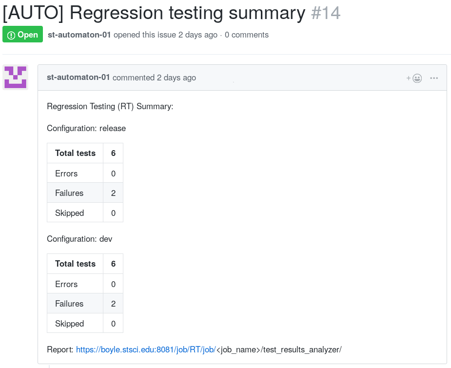

This Jenkins shared library provides common utility classes and functions used to
support continuous integration (CI) build and test jobs for projects within the spacetelescope organization.

Note: For jobs spawned as a result of the creation of a pull request (PR), Jenkins behaves differently than the Travis CI service (https://travis-ci.org/) in that the build will use the HEAD commit of the PR branch only, while Travis typically will run the build/test job on the _merge commit_ between the PR branch and the master branch.

## A Simplified Job Definition Syntax

Functionality provided that extends the native Groovy syntax approach
1. Terminate job execution immediately (with a success status) when the string `[skip ci]` or `[ci skip]` is found in the commit message.
2. Selection of either parallel (default) or sequential execution of the specified build matrix.
3. Automatic creation of a conda environment with user-specified dependencies to host the build.

This library's functionality is automatically made available to every Jenkinsfile hosted in the spacetelescope Github organization.

An example job that builds three parallel combinations and runs tests on one of them, posting a
summary of test results for all build configurations if any test failures or errors occur.

```groovy
// Obtain files from source control system.
if (utils.scm_checkout()) return


// Allow modification of the job configuration, affects all relevant build configs.
// Pass this object in the argument list to the`run()` function below to apply
// these settings to the job's execution.
jobconfig = new JobConfig()
jobconfig.post_test_summary = true


// Config data to share between builds.
CFLAGS = 'CFLAGS="-m64"'
LDFLAGS = 'LDFLAGS="-m64"'
DEFAULT_FLAGS = "${CFLAGS} ${LDFLAGS}"
// Some waf flags cause a prompt for input during configuration, hence the 'yes'.
configure_cmd = "yes '' | ./waf configure --prefix=./_install ${DEFAULT_FLAGS}"
 
 
// Define each build configuration, copying and overriding values as necessary.
bc0 = new BuildConfig()
bc0.nodetype = "linux-stable"
bc0.name = "debug"
LOCAL_VARIABLE='use_me_now'
bc0.env_vars = ['MY_VAR=' + LOCAL_VARIABLE,  // (Early expansion) Compose string locally, then pass to environment.
                'PATH=./_install/bin:$PATH', // (Late expansion) $PATH gets expanded later by the shell hosting the build.
               ]
bc0.build_cmds = ["${configure_cmd} --debug",
                  "./waf build",
                  "./waf install"]
 
 
bc1 = utils.copy(bc0)
bc1.name = "release"
bc1.build_cmds[0] = "${configure_cmd} --release-with-symbols"
bc1.test_cmds = ["conda install -q -y pytest requests astropy",
                 "pip install -q pytest-remotedata",
                 "pytest tests --basetemp=tests_output --junitxml results.xml --remote-data"]
bc1.failedUnstableThresh = 1
bc1.failedFailureThresh = 6
 
 
bc2 = utils.copy(bc0)
bc2.name = "optimized"
bc2.build_cmds[0] = "${configure_cmd} --O3"
 
 
// Iterate over configurations that define the (distibuted) build matrix.
// Spawn a host of the given nodetype for each combination and run in parallel.
// Also apply the job configuration defined in `jobconfig` above.
utils.run([bc0, bc1, bc2, jobconfig])
```

### Utils Library
The build configuration syntax shown here is provided by the `utils` library which contains two main components, the `utils` functions and the `BuildConfig` class.

#### Functions
The `utils` library provides several functions:

| Function                           | Description                                                                 |
| --- | --- |
| `if (utils.scm_checkout()) return` | <ul><li>  Performs the cloning of the git repository that contains the Jenkinsfile.</li><li>Handles delivery of checked-out files to all subsequent build nodes called upon via the `utils.run()` function described below so that only a single clone is required to feed all parallel builds.  </li><li>  When used within the full `if (utils.scm_checkout()) return` clause, it also handles aborting the build immediately after the clone if either the text `[skip ci]` of `[ci skip]` if found in the latest commit message. Note: The `if` statement is unavoidable due to how Jenkins handles script termination.  </li></ul>  Accepts: <ul><li>`skip_disable=true` (default is false)  </li></ul>  Will ignore any `[skip ci]`/`[ci skip]` directive found in the latest commit message. This is used in certain regression testing jobs that run on a schedule, the execution of which should never be skipped due to skip directives found in the commit history. |
| `utils.copy()` | <ul><li>  Copies the single object passed in as an argument into a new instance holding all the same attribute values. Useful to avoid duplication of parameters when configurations are similar to one another.  </li></ul> Accepts:  <ul><li> a single `BuildConfig` object  </ul></li>  |
| `utils.run(config_list, concurrent=true)` | <ul><li>  Responsible for running build tasks on separately provisioned hosts based on a list of configuration objects passed.  </li><li>  Parallel builds show up in the Jenkins (Blueocean) interface under the 'Matrix' heading. </li><li>  Serial builds show up in the Jenkins (Blueocean) interface under 'Serial-#' headings.  </li></ul>  Accepts:  <ul><li>  a single list of BuildConfig objects  </li><li>  (optional) A boolean named `concurrent`  Default is `true`. When 'false', each `BuildConfig` is built sequentially in the order in which they appear in the list passed to this function. NOTE: When `concurrent=False` (a sequential build), any failure encountered when executing a configuration will terminate the entire sequence.  </li></ul>

#### JobConfig Class
This class contains properties that may be adjusted to control the behavior of the overall Jenkins job.
A JobConfig object must be created as shown in the example above and then passed in to the `run()` function in the list of BuildConfig objects for the customizations to be honored.

It has the following properties:

| Member | Type | Required | Purpose |
| --- | --- | --- | --- |
| `post_test_summary` | boolean | no | When `true`, will cause the creation of a Github issue on the project's repository containing a summary of test results produced by all build configurations hosted in the the job if any tests returned a `failure` or `error` status. Default is false, meaning no summary issues will be created upon test failures or errors. When set to `true`, if no test failures or errors occur, a summary post will not be generated. |

#### Test Summary Issue Posts
If test summaries are requested using the `post_test_summary` property of the JobConfig class as described above, each Jenkins job that produces one or more test errors or failures will result in a single new Github issue being posted to the project's repository.

An example of such an issue:


#### BuildConfig Class
The utils library also provides the definition of a class called BuildConfig that may be used to create build configuration objects used to define build tasks to be run on various hosts.

It has the following properties:

| Member | Type | Required | Purpose |
| --- | --- | --- | --- |
| `nodetype` | string | yes | The Jenkins node label to which the build is assigned |
| `name`     | string | yes | A (short) arbitrary name/description of the build configuration. Builds are named `<nodetype>/<name>` in the build status GUI. I.e. "linux/stable" or "linux/debug" |
| `conda_packages` | list of strings | no | If this list is defined, the associated build job will create a temporary conda environment to host the job which contains the packages specified. Package specifications are of the form <ul><li>  `<package_name>`  </li><li>  `<package_name>=<version>`  </li></ul>  Example: `bc0.conda_packages = ["pytest", "requests", "numpy=1.14.3"]`  |
| `conda_override_channels` | boolean | no | Instructs the conda environment creation process to not implicitly prepend the anaconda defaults channel to the list of channels used.  This allows the priority of channels to be used for environment creation to be specified exactly in the order of channels provided in the `conda_channels` list, described below.  If `conda_packages` is not defined in the Jenkinsfile this property is ignored. |
| `conda_channels` | list of strings | no | The list of channels, in order of search priority, to use when retrieving packages for installation.  If `conda_override_channels` is not defined, this list will have the conda `defaults` channel implicitly prepended to it at installation time.  If `conda_packages` is not defined in the Jenkinsfile this property is ignored.  Example: `bc0.conda_channels = ["http://ssb.stsci.edu/astroconda"]`  |
 | `conda_ver` | string | no | The version of conda to use when creating environments to host the build. If not supplied, a recent version of conda will be obtained.  |
 | `env_vars` | list of strings | no | Allow configuration of the shell environment in which build and test commands are run.  Of note:  <ul><li>  Only single-quoted `'` strings are supported in order to accommodate both early and late variable expansion (see later bullet points). An error will be thrown and the job status set to "FAILED" if double-quoted strings are used in this list.  </li><li>  Relative path characters such as `.` and '..' are honored with respect to the isolated build WORKSPACE directory into which the source repository is cloned and the build job takes place.  </li><li>  (Early expansion) -  Variables can be expanded into the `env_vars` list items before they are passed to the shell. This is useful for programmatic composition of values that takes place within the Jenkinsfile.   Example: <ul><li>  MATRIX_SUFFIX is a variable local to the Jenkinsfile script. </li><li>  'BUILD_MATRIX_SUFFIX=' + MATRIX_SUFFIX is how to compose a list item that will be expanded using the value of MATRIX_SUFFIX _prior_ to being passed to the shell. </li></ul> <li> (Late expansion) - Variable names prefixed with `$` are dereferenced to their value by the bash shell responsible for hosting the job's activities. The variable name to dereference must exist at the time the entry in the `env_vars` list is processed on each parallel node. I.e. variables can appear in the definition of other variables later in the list (the list is processed in order.)  </li></ul>  |
 | `build_cmds` | list of strings | yes | These commands are run in their order of appearance in this list with the default shell environment and any modifications to that environment provided by the `env_vars` list described above.  <ul><li>  Varables defined in the Jenkinsfile script itself may appear in these commands via `${varname}` notation and are interpolated at script execution time.  </li><li>  These command are executed BEFORE any optional `test_cmds`.  </li></ul>  |
| `test_cmds` | list of strings | no | These commands are run in their order of appearance in this list with the default shell environment plus any modifications to that environment provided by the `env_vars` list described above.  <ul><li>  If this list is not set for a build configuration, no test commands are run and no test report is generated.  </li><li>  If present, these commands are executed AFTER the build_cmds.  </li></ul> |
| `failedFailureNewThresh` |	integer |	no | (Default is no threshold set.)	The threshold for the number of newly appearing test failures that will cause the build to be flagged as "FAILED". |
| `failedFailureThresh` |	integer |	no | (Default is no threshold set.)	The threshold for the number of test failures that will cause the build to be flagged as "FAILED". |
| `failedUnstableNewThresh`	| integer	| no |  (Default is no threshold set.) The threshold for the number of newly appearing test failures that will cause the build to be flagged as "UNSTABLE". |
| `failedUnstableThresh`	| integer	| no | (Default is no threshold set.) The threshold for the number of test failures that will cause the build to be flagged as "UNSTABLE". |
| `skippedFailureNewThresh`	| integer	| no | (Default is no threshold set.) The threshold for the number of newly appearing skipped tests that will cause the build to be flagged as "FAILED". |
| `skippedFailureThresh` | integer | no | (Default is no threshold set.) The threshold for the number of skipped tests that will cause the build to be flagged as "FAILED". |
| `skippedUnstableNewThresh`	| integer	| no | (Default is no threshold set.) The threshold for the number of newly appearing skipped tests that will cause the build to be flagged as "UNSTABLE". |
| `skippedUnstableThresh`	| integer	| no | (Default is no threshold set.) The threshold for the number of skipped tests that will cause the build to be flagged as "UNSTABLE". |


### Test Results Customization

Under certain circumstances it might be desirable force a job to produce a PASSING status even if a certain number of tests are failing.

This approach may be seen in the following documentation for the xUnit plugin which is used to provide the test report functionality in the CI system. The heading "Accept a Baseline". https://jenkins.io/blog/2016/10/31/xunit-reporting/ describes the scenario and how to set the appropriate thresholds.

Two things need to be done to allow this type of build/test classification.

* The test reporting thresholds must be set correctly to allow a certain number of 'expected failures'.
* No stages in the build may return a failure status 
  * The implication of this requirement is that any commands run, in the test_cmds list in particular, must not return an error code. Tools such as pytest return an error status if any tests in the suite fail and so will cause that stage in the Jenkins job to show a failure status. NOTE: The most severe failure status in any build stage is always propagated up to be reflected in the overall job status.
  * To prevent the test execution command in this case from causing the entire job to return a FAILURE status, the command may be adjusted to use the following construction.
  
  ```<command_that_returns_error_status_when_a_tests_fail> || true``` 
  
  i.e. in following the example job definition from above:
  
  ```"pytest tests --basetemp=tests_output --junitxml results.xml --remote-data || true"```
  
  This will cause the command to always return a success status, even if the pytest invocation itself returns and error code.
  
WARNING: Adding   `|| true`    to arbitrary commands will mask problems and make diagnosing failures more difficult than necessary. Only use this approach in specific instances where it is required to suppress unnecessary failure return values from testing tools that cannot be suppressed in any other way.

### Build Sequence

This is a brief description of the job execution sequence to aid in understanding CI system behavior when constructing build configuration scripts.

1. A repository in https://github.com/spacetelescope has a Jenkinsfile added to one or more branches or PRs. The Jenkinsfile describes the build and test activities to take place upon a git push event.
2. A git push event takes place on a branch containing a Jenkinsfile.
3. Jenkins initiates a clone of the repository where the push event occurred.
4. Source check out
   a. When the   `if (utils.scm_checkout()) return`   construct is used, the commit message is examined and the build is immediately terminated with a SUCCESS status if the string `[skip ci]` or `[ci skip]` appears in the latest commit message. If no such string is found, job execution continues.
   b. Jenkins creates a "stash" of all the files that were retrieved by the git clone and distributes them internally ("unstashes" them) to each build host that is spawned later in this sequence. This is done to minimize network calls to external resources.
5. The Jenkinsfile is executed as a Jenkins "pipeline script"
   1. For every build configuration passed in to the utils.run() function a docker container will be created to host the build and test activities for that configuration.
   2. Environment variables specified in env_vars list are added to the environment before executing each command in build_cmds and then test_cmds in their order of appearance in those lists.
   3. After the last test_cmds command is executed, Jenkins examines the build environment for a filename with an .xml extension. If one is found, it is assumed to be a JUnit-compliant test report and is read.
      1. Any test reporting thresholds supplied in the build configuration are applied and the results presented accordingly via the Jenkins user interface.
